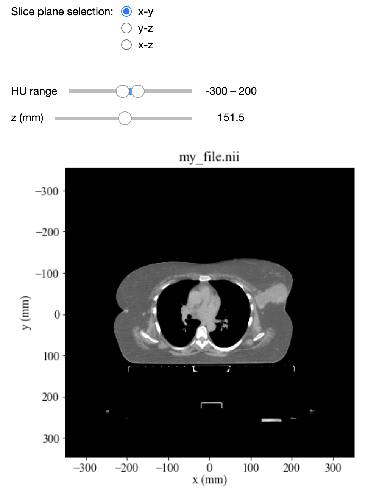
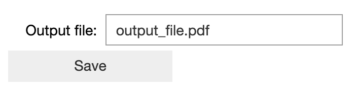
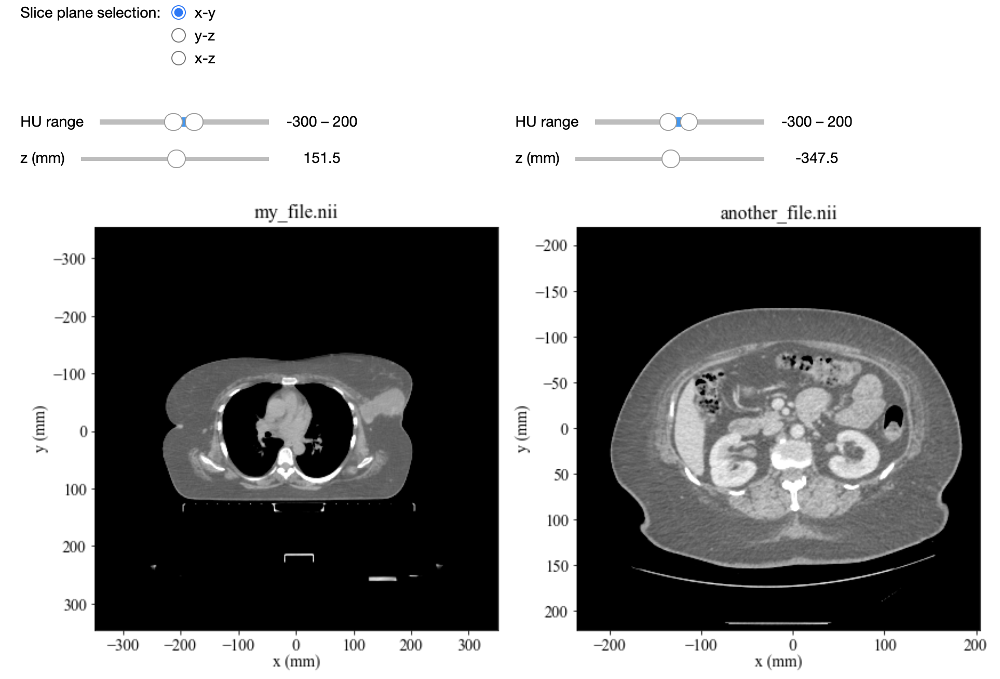
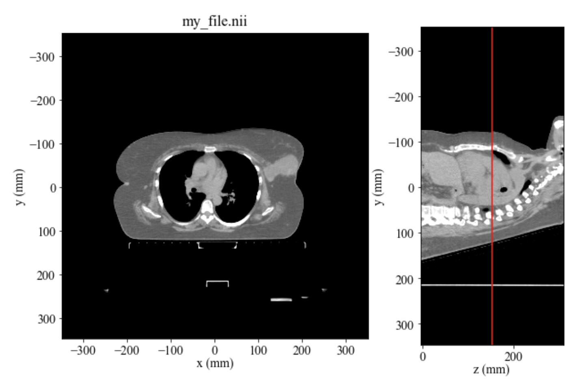

<

# QuickViewer package

A package for interactively viewing medical image data.

### Table of contents

I) [Installation](#i-installation)

II) [How to use QuickViewer](#ii-how-to-use-quickviewer)

1) [Basic usage](#1-basic-usage)

2) [Image comparisons](#2-image-comparisons)

3) [Dose fields](#3-dose-fields)

4) [Masks](#4-masks)

5) [Structures](#5-structures)

6) [Image registration tools](#6-image-registration-tools)

7) [Time series](#7-time-series)

8) [Usage outside Jupyter](#8-usage-outside-jupyter)

## I) Installation

### Installing QuickViewer via pip

To install QuickViewer via [pip](https://pypi.org/project/pip/), run the following command from a terminal:
```
pip install git+https://github.com/hpullen/quickviewer.git
```
QuickViewer is continually being developed, so make sure to check for updates often! QuickViewer can be updated with the command:
```
pip install --upgrade git+https://github.com/hpullen/quickviewer.git
```
If you wish to uninstall quickviewer, simply run:
```
pip uninstall quickviewer
```
### Setting up Jupyter notebooks

QuickViewer works best inside a Jupyter notebook; see [here](https://jupyter.org/install.html) for installation instructions. Once you have Jupyter notebooks installed, you need to run the following command once to ensure that QuickViewer's widgets will work:
```
jupyter nbextension enable --py widgetsnbextension
```
Now you can launch a Jupyter server using
```
jupyter notebook
```
in which you can enjoy QuickViewer and its widgets!

## II) How to use QuickViewer

### 1. Basic usage

QuickViewer can be used to view medical images in [NIfTI](https://nifti.nimh.nih.gov/) format or [NumPy arrays](https://numpy.org/doc/stable/reference/generated/numpy.array.html). DICOM files are currently not supported, but there are various tools for converting from dicom to NIfTI such as [dcm2niix](https://www.nitrc.org/plugins/mwiki/index.php/dcm2nii:MainPage).

To use QuickViewer to view a NIfTI image, first import the QuickViewer class:
```
from quickviewer import QuickViewer
```
and then create a QuickViewer instance, giving the path to your NIfTI file:
```
QuickViewer("my_file.nii")
```
This will launch a viewer that looks something like this:



The widgets can be used to change
- The image orientation (x-y = axial view; y-z = sagittal view; x-z = coronal view)
- The range of Hounsfield Units to cover;
- The position of the slice currently being displayed.

#### Saving a QuickViewer plot

QuickViewer plots (minus the widgets) can be saved to an image file by providing the extra argument `save_as` when QuickViewer is called:
```
QuickViewer("my_file.nii", save_as="output_image.pdf")
```
The file `output_image.pdf` will automatically be created when this command is run. When QuickViewer is run with the `save_as` option, an extra widget will appear below the image:



This can be used to overwrite the original output file after some changes have been made via the other widgets, or to save the image to a different file.

#### Displaying multiple images

To show multiple images side-by-side, you can give QuickViewer a list of filepaths rather than a single path:
```
QuickViewer(["my_file.nii", "another_file.nii"])
```
The result will look something like this:



If the two images are in the same frame of reference, they will automatically share their HU and position sliders, so that you can scroll through both simultaneously. This behaviour can be turned off with the `share_slider` argument:
```
QuickViewer(["my_file.nii", "another_file.nii"], share_slider=False)
```

#### Orthogonal view

An orthogonal view of the image can be displayed alongside the main view, with an indicator to show where in the image the current slice is. This option is accessed by running:
```
QuickViewer("my_file.nii", orthog_view=True)
```
For example, when viewing in the x-y (axial) orientation, the y-z (sagittal) view will be displayed:



#### More display settings

##### Initial QuickViewer config

By default, QuickViewer will show the central slice of the axial plane, with the HU range set to `-300 -- 200`. These initial settings can be changed via the arguments:
- `init_view`: set this to `x-y`, `y-z`, or `x-z` to set initial orientation (default = `x-y`);
- `init_pos`: initial slice position in mm (will be rounded to the nearest slice;
- `hu`: set this to a pair of values (e.g. `hu=[-500, 500]`) to set the initial HU range.

To show scales in terms of voxel numbers rather than mm, run QuickViewer with the argument `scale_in_mm=False`. The initial slice position can be set via the `init_sl` argument.

##### More Housfield Unit options

To define the HU range in terms of a central value and window width, rather than minimum and maximum values:
- Set the `hu` argument to a single value, which will be taken as the window centre;
- Optionally set the `hu_width` argument to change the initial window width (default = 500).
Both the HU centre and HU width can be change later via widgets.

The full range of available HU values can also be adjusted by changing the `hu_limits` argument (default = `[-2000, 2000]`); changing this might be useful if you're viewing an image with a much smaller range of intensities.

##### Custom titles

To give your plot a custom title, set the `title` argument:
```
QuickViewer("my_file.nii", title="A CT scan image")
```
When viewing multiple images, multiple titles can be set by providing a list:
```
QuickViewer(["file1.nii", "file2.nii"], title=["First image", "Second image"])
```

##### Zooming, panning and downsampling

If QuickViewer is run with the setting `zoom_ui=True`, extra widgets for zooming and panning will be displayed.

To set the initial zoom level and image centre (regardless of whether `zoom_ui` is set), use:
- `zoom`: set to either a single value for zoom in all directions, or to a list of 3 values for the zoom level in each orientation.
- `zoom_centre`: centrepoint of the image, if zooming is used. This should be a list containing the x, y, and z coordinates of the desired centre.

For large images, you may sometimes wish to downsample for speed. This can be done via the `downsample` parameter; similar to the `zoom` parameter, this can either be a single value setting the downsampling factor to be equal in all directions, or a list of three values for each direction.

##### Other display options

There are  several options for fine-tuning the appearance of the plot:
- `colorbar`: show a colorbar for the HU grayscale.
- `figsize`: sets the figure height in inches (default = 5 inches).
- `xlim`/`ylim`/`zlim`: set these to a pair of values to specify custom `x`, `y`, or `z` limits (i.e. to crop the plot).
- `plots_per_row`: maximum number of images to display per row, when using multiple images; this allows images to be spread over multiple rows.
- `major_ticks`: sets the interval between major axis tick marks.
- `minor_ticks`: sets the number of minor tick marks to display between each pair of major tickmarks (by default, no minor ticks are shown).
- `ticks_all_sides`: if set to True, tick marks will be shown at the top and right-hand side of plots as well as the bottom and left-hand side.

#### Viewing a NumPy array

QuickViewer can be used to view NumPy arrays as well as NIfTI images. This is done by giving the array in place of the NIfTI filepath:
```
import numpy
my_array = numpy.random.rand(512, 512, 40)
QuickViewer(my_array)
```
By default, QuickViewer will set the origin to `(0, 0, 0)` and the voxel sizes in all directions to 1mm. This can be changed either by providing the `voxel_sizes` and `origin` arguments (which should be lists in order `(x, y, z)`) or by giving an affine matrix via the `affine` argument, e.g.:
```
QuickViewer(my_array, voxel_sizes=[2.5, 2.5, 4], origin=[-200, -300, 0])
```

### 2. Image comparisons

If two images are loaded into QuickViewer they can be compared in an additional plot. To do this, set the `comparison` argument to `True`, e.g.:
```
QuickViewer(["image1.nii", "image2.nii"], comparison=True)
```
This will give the following output:

The "comparison" dropdown menu allows you to switch the comparison type between:
- Chequerboard image
- Red/blue overlay
- Difference image

The initial number of panes in the chequerboard image can be set via the `cb_splits` argument, and can later be changed via the slider. Similarly, the initial overlay opacity can be set via the `overlay_opacity` and later change via a slider. 
The order of the images to be compared can be changed by checking the "invert" box.

To display only the comparison image, set `comparison_only` to `True`.

To display individual comparison types side-by-side, a list of the desired types (any from "chequerboard", "overlay", "difference", and "all") in the desired order should be passed to the `comparison` argument.

For example, to plot all three comparison images without plotting the separate images themselves, run:
```
QuickViewer(["image1.nii", "image2.nii"], comparison=["chequerboard", "overlay", "difference"], comparison_only=True)
```
to give the following output:

### 3. Dose fields

Dose fields can be overlaid on top of images by setting the `dose` parameter to the path to a NIfTI file or array the same shape as the image, e.g.
```
QuickViewer("image.nii", dose="dose.nii", colorbar=True)
```
will give

Note that setting the `colorbar=True` option will draw a colorbar for the dose field as well as the intensity of the underlying image.

The initial opacity of the dose field can be specified via the `dose_opacity` argument or adjusted later via the slider.

By default, the range of the dose colorscheme will be set automatically based on the contents of each slice. To fix it to a set range, use the `dose_range` parameter, e.g.
```
QuickViewer("image.nii", dose="dose.nii", dose_range=[0, 60], colorbar=True)
```
will fix the colorbar to go from 0 -- 60 on every slice.

#### Dose fields on multiple images

When multiple images are loaded but only one dose path is given, the dose field will only be overlaid on the first. Dose fields can be set for multiple images by giving setting `dose` parameter to a list the same length as the list of images, containing the desired dose field for each. To skip an image, put `None` in this list.

For example, to load two images and overlay a dose field on the second only:
```
QuickViewer(["image1.nii", "image2.nii"], dose=[None, "dose2.nii"])
```

#### Dose comparisons

TBC

### 4. Masks

QuickViewer can apply a mask in a NIfTI file or array to an image. To do this, pass the NIfTI path or NumPy array to the `mask` argument, e.g.
```
QuickViewer("image.nii", mask="mask.nii")
```
which would give:

The mask can be turned on or off using the "apply mask" checkbox.

Some additional options for masks are:
- `mask_color`: sets the color of masked regions.
- `mask_threshold`: sets the threshold of voxels in the mask array which should be masked out.
- `invert_mask`: mask out voxels below the threshold rather than above it.
- Multiple masks for multiple images are loaded in the same way as multiple dose fields ([see above](#dose-fields-on-multiple-images))

### 5. Structures

Loading structures
How to provide:
wildcard for files, wildcard for folders, single folder, single file, list of files
Multiple images (nest dictionary)

Name inferred from filename

Plot settings and turning structures on and off

Customising names and colors

Labelling groups of structures

#### Viewing structure information

To display a table containing some geometric information about each structure, set `struct_info=True`.

Saving the table to csv or tex

#### Structure comparisons

Comparison metrics

Ways of matching structures:
- Matching by name (ignore_unpaired)
- Pairwise (default if no name matches, or set "pairs")
- Compare to consensus of all others

Structure comparison table
Saved in same way as above

Extras for consensus:
Note that turning off one removes it from the group 
Plotting: group others

Masking out dose field

### 6. Image registration tools

QuickViewer provides several useful functionalities related to displaying the results of an image registration. 

#### Jacobian determinant

Set the `jacobian` parameter to a path to a jacobian determinant file, or, if multiple images are loaded, to a list matching the length of the number of images loaded. E.g.:
```
QuickViewer("image.nii", jacobian=True, colorbar=True)
```
would produce:

Note that if `colorbar=True` is set, an extra colorbar will be drawn for the Jacobian determinant field. The initial opacity can be set via `jacobian_opacity` and changed via a slider. The range (default 0.8 -- 1.2) can also be adjusted via a slider.

#### Deformation field

Deformation fields can be loaded via the `df` argument and plotted as a "quiver" or "grid" plot. E.g.
```
QuickViewer("image.nii", df="deformationField.nii")
```

Initial plot type can be set via `df_plot_type`, and changed later via the dropdown menu.

Matplotlib settings can be adjusted via `df_kwargs`, e.g. to change the color and linewidth of a grid plot:
```
QuickViewer("image.nii", df="deformationField.nii", df_plot_type="grid", df_kwargs={"linewidth": 3, "linecolor": "red"})
```

#### Visualising deformation with a grid

The deformation of the moving image when it is transformed can be visualised by creating a regular grid the same shape as the moving image, and then deforming it to match the shape of the transformed image.

A script to create the initial regular grid images is found in . Usage:

This will make three files, one in each orientation. These should then be transformed using your preferred image transformation software.

The transformed grids can be visualised on top of the transformed image in QuickViewer by setting them as masks. The `mask` parameter can be a dictionary, where the keys are the three orientations ("x-y", "y-z and "x-z") and the values are the paths to the transformed masks for each orientation. The `invert_mask` option should be set, so that voxels containining gridlines are masked.

E.g. if your transformed grid images were in the files "final_grid_x-y.nii" etc, you should run:
```
mask_dict = {"x-y": "final_grid_x-y.nii",               
             "y-z": "final_grid_y-z.nii",              
             "x-z": "final_grid_x-z.nii"}
QuickViewer("final_image.nii", mask=mask_dict, invert_mask=True, mask_color="green")
```
which would look like this:

#### Applying manual translations

When two images are loaded in QuickViewer, you can turn on the ability to apply a manual translation to the second image. This is useful in combination with a comparison image, in particular the "overlay" option. E.g.:
```
QuickViewer(["image1.nii", "image2.nii"], translation=True, comparison="overlay")
```
gives the following output:

The three translation sliders can be used to translate the second image by an integer number of voxels in each direction. The translation sizes in mm can then be written to a file.

### 7. Time series

QuickViewer can load a series of scans of the same shape taken at different points in time. You can then scroll through these images with a time slider.

- Infer via filenames
- Give via dictionary

Example

Including structures
Including doses

### 8. Usage outside Jupyter

#### From the command line:
1. A script for creating a quickviewer plot from the command line can be found in `quickviewer/bin/quick_view.py`. The basic usage for viewing a NIfTI file is:
```quick_view.py <filename>```.
2. To see the available input options for this script, run:
```quick_view.py -h```
3. Running this script will create a figure in a seperate window, which can be interacted with using the following commands:
    - **scroll wheel**: scroll through image one slice at a time
    - **left/right arrows**: scroll through image one slice at a time
    - **up/down arrows**: scroll through image five slices at a time
    - **v**: switch orientation
    - **d**: change dose field opacity
    - **m**: turn masks on and off
    - **c**: toggle structure plotting type between contours, masks, and none
    - **j**: jump between the structures on the image
    - **i**: invert any comparison images
    - **o**: change the opacity of overlay comparison image

#### Inside a python script:
The `QuickViewer` class can be imported into a python script by adding
```from quickviewer import QuickViewer```
to the script. Creating a `QuickViewer` object inside the code will cause a window containing the plot to be opened when the code is run.
